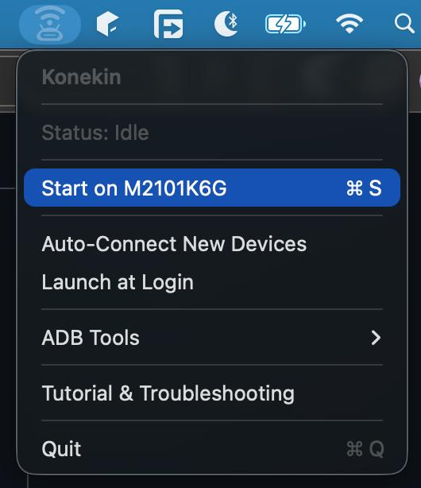
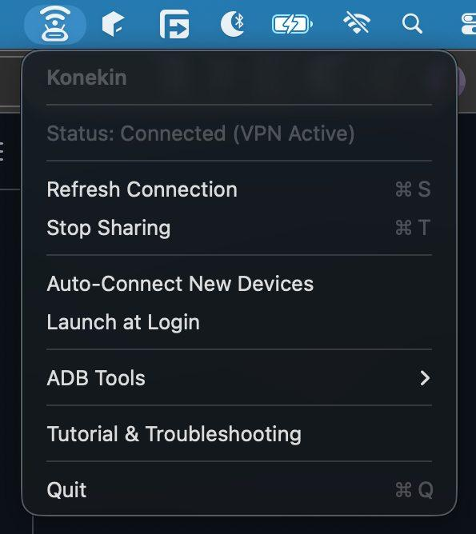
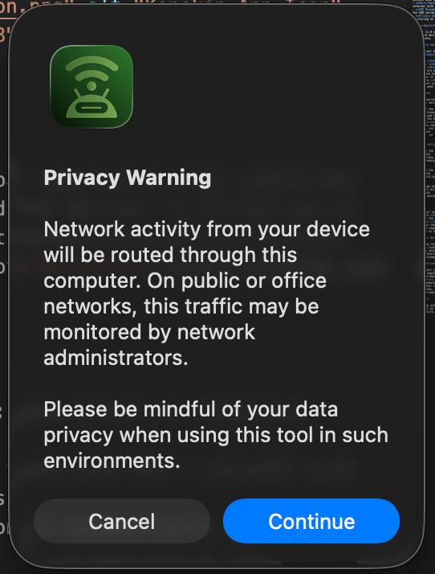

<p align="center">
  
</p>

# Konekin

Konekin is a macOS menu bar application that simplifies reverse tethering for Android devices. It allows you to share your Mac's internet connection with your Android device via USB, powered by [Gnirehtet](https://github.com/Genymobile/gnirehtet).

## Features

- **Menu Bar Interface**: Easy access to connection controls and status.
- **Reverse Tethering**: Share your Mac's internet with connected Android devices.
- **Auto-Connect**: Option to automatically connect to new devices when detected.
- **Multi-Device Support**: Select which device to share internet with if multiple are connected.
- **ADB Management**: Built-in tools to restart or kill the ADB server.
- **Privacy Awareness**: Includes warnings about network monitoring on public networks.
- **Modern Aesthetics**: A clean, native macOS experience.

## 📸 Screenshots

| Idle State | Connected State |
| :---: | :---: |
|  |  |

| Privacy Warning |
| :---: |
|  |

## Prerequisites

- macOS 11.0 or later.
- Android device.
- USB cable.

## Android Setup

To make your device detectable by Konekin, you must enable **USB Debugging**:

1.  Open **Settings** on your Android device.
2.  Go to **About Phone**.
3.  Find **Build Number** and tap it **7 times** until you see "You are now a developer!".
4.  Go back to **System** > **Developer Options** (or search for it in Settings).
5.  Enable **USB Debugging**.
6.  Connect your device to your Mac and **Authorize** the computer when prompted on the phone.

## Download

For the easiest installation, download the latest pre-built version:

1.  Go to the [Releases](https://github.com/Dhanfinix/Konekin/releases) page.
2.  Download the `Konekin_Installer.dmg` file.
3.  Open the DMG and drag **Konekin** to your **Applications** folder.
4.  If you see an "App is damaged" error (due to ad-hoc signing), run this in your terminal:
    ```bash
    xattr -cr /Applications/Konekin.app
    ```

## Installation & Build (For Developers)

1.  Clone the repository:
    ```bash
    git clone https://github.com/Dhanfinix/Konekin
    cd Konekin
    ```

2.  Build the application using the included script:
    ```bash
    ./build.sh
    ```

3.  The app will be built in the `build/` directory. You can run it directly:
    ```bash
    open build/Konekin.app
    ```

## Usage

1.  Connect your Android device via USB.
2.  Launch **Konekin**.
3.  Click the Konekin icon in the menu bar.
4.  Select **Start on [Device Model]**.
5.  Accept the privacy warning to start sharing.
6.  A VPN request will appear on your Android device; accept it to enable the connection.

## Privacy Warning

When using this tool, network activity from your mobile device is routed through your computer. On public or corporate networks, this traffic may be visible to network administrators. Please be mindful of your data privacy in such environments.

## 🧪 Experimental Notice

This project is a complete exploration of AI-driven software engineering. **Konekin** was built entirely through orchestration by **Dhanfinix** using the **Antigravity IDE**. Since the codebase is 100% machine-generated across various LLM models, the human orchestrator (Dhanfinix) accepts no responsibility for malfunctions, security gaps, or unexpected behavior. Use this experimental wrapper at your own risk.

## Credits

- This app uses [Gnirehtet](https://github.com/Genymobile/gnirehtet) by Genymobile for the core reverse tethering functionality.
